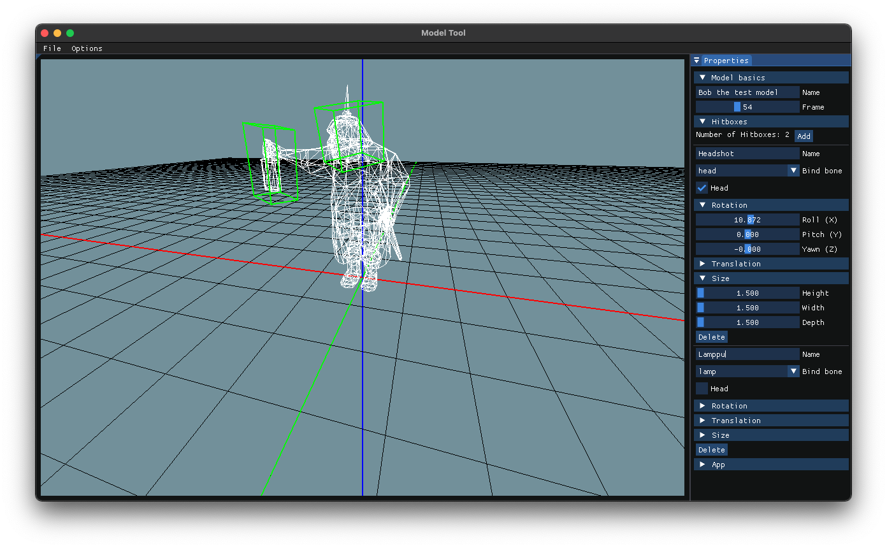

# ModelTool [](https://github.com/jackeri/ModelTool/actions/workflows/cmake.yml)
> Jere 'Jacker' S. 2021

## What is this for

This is a dead simple tool that can load (atleast in the future) and somwhat modify model data.

The tool is mainly meant for the Wolfenstein: Enemy territory models and any new model formats that are included in
the [ET:Legacy](https://www.etlegacy.com) project.

## Usage

The tool uses the same package loading system as the game itself. When the application starts it will ask the user
for a folder path.

TODO: write a full manual at point & include images

### Hitboxes

The user can add hitboxes to a model.



## Compile

Fetch all the submodules.

```
git submodule update --init
```

Run CMake, the build should support Win, OSX and Linux.

```
cmake -B build -S .
cmake --build build --config Release
```

To run tests, just execute `ctest` in the build directory

To run the binary, execute `./build/ModelTool` in the build directory. On some unix platforms using `LC_CTYPE=en_US.UTF-8 build/ModelTool` might be needed.

# License

ModelTool is licensed under the MIT License, see [LICENSE](./LICENSE.txt) for more information.
